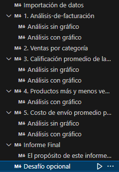
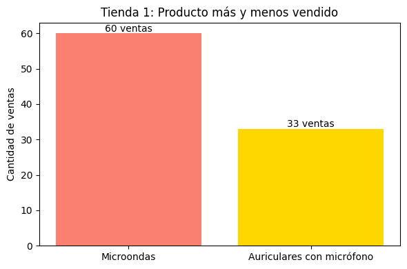
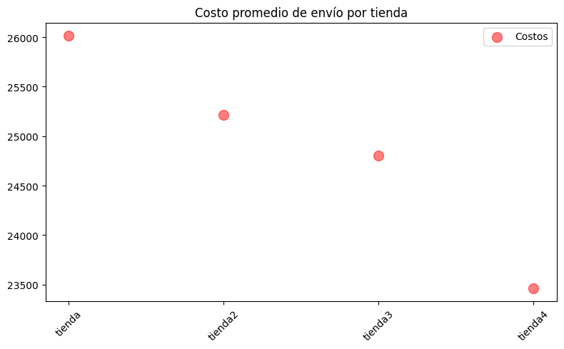

## El propósito de este código es ayudar a Juan a decidir cuál de sus 4 tiendas es prescindible por bajo rendimiento en ventas y altos costes.
---
## Estructura del proyecto y organización de los archivos.
> Disclaimer: A medida que fuí avanzando en la elaboración de este challenge fuí consultando y cediendo ante la 
> IA que usé para consultas generales (inicialmente copilot, luego grok), pero siempre dentro de lo que creo que puedo 
> aprender y retener, es decir, pude haber complejizado aún más el resultado final, pero a costa de perder el 
> registro de lo que hacía. Espero esto sea bien visto por los profesores y compañeros. 

##### Estructura:

#### El proyecto está compuesto por un primer bloque de código utilizado para importar los dataframes de las cuatro tiendas a analizar, seguido de 5 secciones de análisis de la información obtenida que se subdividen en análisis **con** y **sin** gráfico cada uno, excepto en el punto 2 (ventas por categoría). Al final se incluye un breve informe final, con un resúmen de la data obtenida y un desafío opcional para entender la distribución geográfica de las ventas.
---
## Ejemplos de gráficos e insights obtenidos
#### Gráficos de pastel 

#### Gráficos de barra 

#### Gráficos de scatter 

---
## Instrucciones para ejecutar el notebook
#### Cómo correr este Jupyter Notebook en otra PC:
#### Opción 1 - Desde [Google Colab](https://colab.research.google.com/drive/1u47C28XKhk75e9nwieY75fWCfnhW1l-L?authuser=1), sin instalar nada.
#### Opción 2 - Desde Visual Studio Code 
1. Descarga el archivo [AluraStoreLatam.ipynb](https://github.com/reddjedet/challenge-alurastorelatam/blob/main/AluraStoreLatam.ipynb) (click en download raw file)
2. Instala [Visual Studio Code](https://code.visualstudio.com/Download)
3. Abre VS Code
4. Ve a la pestaña **Extensiones**
5. Busca e instala:
   - **Python** (por Microsoft)
   - **Jupyter** (por Microsoft)
6. Abre la **terminal** (Ctrl+ñ)
7. Escribe este comando y presiona Enter: 
`pip install pandas matplotlib numpy seaborn`
8. Abre el archivo descargado en el paso 1
9. Haz clic en "Run All" o ejecuta celda por celda 
¡Listo! Verás gráficos y resultados

